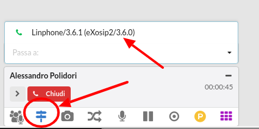

================
Note di rilascio
================

Cambiamenti principali - v3.21.5 - (4 GEN 2021)
===============================================

**Bug fixes**

- `Nel pannello operatore sparivano le icone dei servizi se l'utente non aveva il permesso per visualizzare i fasci <https://github.com/nethesis/dev/issues/5944>`_
- `La porta usata dal proxy flexisip veniva esposta anche se il proxy era disabilitato <https://github.com/nethesis/dev/issues/5943>`_
- `Lo storico delle chiamate non veniva visualizzato correttamente se l'utente non avevo associato nessun interno telefonico <https://github.com/nethesis/dev/issues/5938>`_
- `Alcuni numeri telefonici venivano mostrati in chiaro all'interno del pannello operatore se l'utente effettuava il login tramite l'interno telefonico al posto del proprio nome utente <https://github.com/nethesis/dev/issues/5936>`_
- `Risolto un problema sporadico sui login: si poteva verificare dopo una settimana come dopo un mese in particolari scenari operativi <https://github.com/nethesis/dev/issues/5933>`_
- `Dopo aver effettuato il logout, l'appliczione client continuava a richiedere al server le informazioni sulle chiamate perse in coda <https://github.com/nethesis/dev/issues/5929>`_
- `L'url parametrizzato si apriva anche nelle chiamate tra interni: ora solo per chiamate esterne <https://github.com/nethesis/dev/issues/5927>`_
- `La ricerca in rubrica ora effettua la ricerca anche sul campo "notes" del database <https://github.com/nethesis/dev/issues/5925>`_

**Pacchetti coinvolti**

- ``nethcti3-3.21.5-1.ns7.noarch.rpm``
- ``nethcti-server3-3.20.7-1.ns7.x86_64.rpm``

Cambiamenti principali - v3.21.4 - (27 NOV 2020)
================================================

**Nuove funzionalità e miglioramenti**

- `È stata aggiunta la possibilità di creare un nuovo contatto in rubrica direttamente dallo storico delle chiamate <https://github.com/nethesis/dev/issues/5918>`_
- `L'ordinamento delle schede (tabs) all'interno dello storico chiamate è stato modificato per dare risalto alle informazioni ricercate più frequentemente <https://github.com/nethesis/dev/issues/5913>`_
- `Nello storico delle chiamate è possibile visualizzare l'elenco delle chiamate perse ricevute, tramite una nuova scheda apposita (tab) <https://github.com/nethesis/dev/issues/5912>`_
- `All'interno del pannello operatore, per ciascun utente che abbia abilitato la redirezione automatica, viene visualizzato il numero destinatario <https://github.com/nethesis/dev/issues/5908>`_

**Bug fixes**

- `Un contatto speed-dial può rappresentare un interno telefonico della propria azienda. In alcune circostanze, l'icona colorata che ne rappresenta la presence telefonica, non indicava la situazione reale <https://github.com/nethesis/dev/issues/5922>`_
- `All'interno del pannello operatore ci sono le tre icone per visualizzare gli operatori, fasci e parcheggi: la loro posizione è ora fissa <https://github.com/nethesis/dev/issues/5920>`_
- `Quando si aggiungeva un nuovo contatto attraverso i pulsanti presenti nella lista delle ultime chiamate, veniva sempre visualizzato il servizio Rubrica. Ora viene visualizzato il dialog per inserire i dati rimanendo nel servizio correntemente utilizzato <https://github.com/nethesis/dev/issues/5919>`_
- `L'elenco dei dispositivi visualizzato in alto a destra, mostrava solamente l'indicazione di "Telefono fisico" (oltre a WebPhone). Ora mostra la marca e modello del telefono <https://github.com/nethesis/dev/issues/5910>`_

**Pacchetti coinvolti**

- ``nethcti3-3.21.4-1.ns7.noarch.rpm``
- ``nethcti-server3-3.20.6-1.ns7.x86_64.rpm``

Cambiamenti principali - v3.21.3 - (7 NOV 2020)
===============================================

**Bug fixes**

- `La data delle chiamate perse delle code era errata a causa di una regression <https://github.com/nethesis/dev/issues/5902>`_
- `Dopo un periodo d'inattività di otto ore, il QManager non mostrava alcune informazioni <https://github.com/nethesis/dev/issues/5900>`_
- `Risolto un problema che duplicava le connessioni col database in corrispondenza della reload del server  <https://github.com/nethesis/dev/issues/5898>`_
- `Nel box di gestione chiamata non veniva mostrata l'azienda realtiva del contatto, se presente <https://github.com/nethesis/dev/issues/5897>`_
- `Bug fix e miglioramenti al telefono WebRTC <https://github.com/nethesis/dev/issues/5894>`_
- `Miglioramento delle prestazioni per recuperare la lista delle chiamate perse in coda <https://github.com/nethesis/dev/issues/5889>`_
- `Durante una chiamata video tramite il telefono softphone WebRTC, il video non veniva rimosso dalla connessione sottostante. Ora è possibile abilitarlo/disabilitarlo concretamente. Disabilitato di default <https://github.com/nethesis/dev/issues/5871>`_

**Pacchetti coinvolti**

- ``nethcti3-3.21.3-1.ns7.noarch.rpm``
- ``nethcti-server3-3.20.5-1.ns7.x86_64.rpm``
- ``nethserver-nethvoice14-14.7.3-1.ns7.noarch.rpm``
- ``janus-gateway-0.10.6-1.ns7.x86_64.rpm``
- ``janus-gateway-debuginfo-0.10.6-1.ns7.x86_64.rpm``
- ``nethserver-janus-1.2.1-1.ns7.noarch.rpm``

Cambiamenti principali - v3.21.2 - (21 OTT 2020)
================================================

**Bug fixes**

- `La rimozione di un gruppo del pannello operatore tramite il wizard di NethVoice, poteva causare qualche problema nella visualizzazione del pannello operatore <https://github.com/nethesis/dev/issues/5886>`_
- `In alcuni scenari, in corrispondenza del refresh della pagina sul servizio Pannello Operatore, gli interni risultavano tutti offline <https://github.com/nethesis/dev/issues/5888>`_
- `La rimozione di un utente attraverso il server manager di NethServer non aggiornava le corrispondenti informazioni all'interno del cti <https://github.com/nethesis/dev/issues/5884>`_

**Pacchetti coinvolti**

- ``nethcti3-3.21.2-1.ns7.noarch.rpm``
- ``nethcti-server3-3.20.3-1.ns7.x86_64.rpm``
- ``nethserver-nethvoice14-14.7.2-1.ns7.noarch.rpm``

Cambiamenti principali - v3.21.1 - (18 SET 2020)
================================================

**Bug fixes**

- Dai risultati di una ricerca in rubrica, è possibile visualizzare le customer cards dei contatti. Tale pulsante è stato modificato, splittandolo su più pulsanti ciascuno accanto al relativo numero telefonico. Inoltre in alcuni scenari particolari, le customer cards di default (Anagrafica e Ultime chiamate) non mostravano dati utili, in base all'identificativo numerico con il quale si ricevevano le chiamante:

  - `issue 5870 <https://github.com/nethesis/dev/issues/5870>`_
  - `issue 5868 <https://github.com/nethesis/dev/issues/5868>`_

**Pacchetti coinvolti**

- ``nethcti3-3.21.1-1.ns7.noarch.rpm``
- ``nethcti-server3-3.20.2-1.ns7.x86_64.rpm``

Cambiamenti principali - v3.21.0 - (15 SET 2020)
================================================

**Nuove funzionalità e miglioramenti**

- `Tra le impostazioni utente, nella sezione Code, é stata aggiunta la possibilità di configurare la pausa automatica su tutte le code in corrispondenza della selezione di alcuni stati di presence <https://github.com/nethesis/dev/issues/5860>`_

**Bug fixes**

- Fissato un problema per cui quando si eseguiva la pausa dell'agente su tutte le sue code, sul database venivano creati eventi errati

  - `issue 5861 <https://github.com/nethesis/dev/issues/5861>`_
  - `issue 5860 <https://github.com/nethesis/dev/issues/5860>`_

**Pacchetti coinvolti**

- ``nethcti3-3.21.0-1.ns7.noarch.rpm``

Cambiamenti principali - v3.20.0 - (9 SET 2020)
===============================================

**Nuove funzionalità e miglioramenti**

- `Nuova funzionalità per notificare la presenza di una nuova versione dell'applicazione client <https://github.com/nethesis/dev/issues/5725>`_

**Bug fixes**

- `Risolto il problema sporadico dei login falliti che si verificava in corrispondenza del riavvio del server <https://github.com/nethesis/dev/issues/5855>`_
- `Alcuni parametri del QRCode generato per la mobile app, causava problemi alle notifiche <https://github.com/nethesis/dev/issues/5816>`_
- `Dopo lo stand-by del pc, se la connessione veniva ristabilita in ritardo rispetto al tentativo di connessione del Web Phone, veniva subito visualizzato il popup di warning: ora si attendono 10 secondi <https://github.com/nethesis/dev/issues/5858>`_
- `Il componente asterisk proxy del server è diventato open source e rilasciato tramite modulo node.js NPM <https://github.com/nethesis/dev/issues/5849>`_
- `Risolto il problema degli ascoltatori multipli di eventi che si manifestava durante la navigazione tra più servizi degradando le performance <https://github.com/nethesis/dev/issues/5851>`_
- `Il rebranding non agiva sulla pagina mostrata dall'App Launcher <https://github.com/nethesis/dev/issues/5853>`_

**Pacchetti coinvolti**

- ``nethcti3-3.20.0-1.ns7.noarch.rpm``
- ``nethcti-server3-3.20.0-1.ns7.x86_64.rpm``

Cambiamenti principali - v3.19.2 - (27 LUG 2020)
================================================

**Bug fixes**

- `Risolto il problema che non consentiva il caricamento di file audio mp3 all'interno del servizio Fuori Orario <https://github.com/nethesis/dev/issues/5817>`_
- `Risolta l'errata visualizzazione dello stato telefonico all'interno della pagina Impostazioni -> Dispositivi durante una chiamata <https://github.com/nethesis/dev/issues/5769>`_

**Pacchetti coinvolti**

- ``nethcti3-3.19.2-1.ns7.noarch.rpm``
- ``nethcti-server3-3.19.2-1.ns7.x86_64.rpm``

Cambiamenti principali - v3.19.1 - (7 LUG 2020)
===============================================

**Nuove funzionalità e miglioramenti**

- `Aggiunta la nuova informazione linkedid all'evento extenConvConnected inviato via WebSocket <https://github.com/nethesis/dev/issues/5823>`_
- `Aggiornata la versione del componente Janus-Gateway per il corretto funzionamento del WebPhone <https://github.com/nethesis/dev/issues/5824>`_

**Bug fixes**

- `Risolto il problema della risposta alle chiamate in ingresso: alle volte non funzionava <https://github.com/nethesis/dev/issues/5813>`_
- `Corretta l'errata visualizzazione del nome del modello di telefono usato, visibile all'interno della pagina Impostazioni -> Dispositivi <https://github.com/nethesis/dev/issues/5838>`_
- `Corrette alcune traduzioni <https://github.com/nethesis/dev/issues/5829>`_

**Pacchetti coinvolti**

- ``nethcti3-3.19.1-1.ns7.noarch.rpm``
- ``nethcti-server3-3.19.1-1.ns7.x86_64.rpm``
- ``janus-gateway-0.10.2-1.ns7.x86_64.rpm``
- ``janus-gateway-debuginfo-0.10.2-1.ns7.x86_64.rpm``
- ``nethserver-janus-1.2.0-1.ns7.noarch.rpm``
- ``sofia-sip-1.12.11-19.ns7.x86_64.rpm``

Cambiamenti principali - v3.19.0 - (29 MAG 2020)
================================================

**Nuove funzionalità e miglioramenti**

- `Nuova api "astproxy/incall_audio" per inserire un file audio in una conversazione <https://github.com/nethesis/dev/issues/5808>`_
- `La rest api "astproxy/call" ora restituisce lo "uniqueid" della chiamata, ma solo nel caso di telefoni non supportati o nel caso in cui il centralino sia configurato per funzionare in modalità click2call manuale <https://github.com/nethesis/dev/issues/5806>`_
- `Nuova funzionalità per eseguire uno script lato server in corrispondenza di ogni chiamata in ingresso su un fascio  <https://github.com/nethesis/dev/issues/5805>`_
- `Aggiornata la versione del componente Janus-Gateway per il corretto funzionamento del WebPhone <https://github.com/nethesis/dev/issues/5780>`_
- `È stato aggiunto un nuovo parametro "$UNIQUEID" al funzionamento dell'URL parametrizzato <https://github.com/nethesis/dev/issues/5803>`_
- Aggiunti nuovi dati JSON all'interno dell'evento "extenConvConnected" inviato attraverso la connessione WebSocket, più in particolare sono stati aggiungi i seguenti dati:

  - throughTrunk: ( true | false ) true se la chiamata proviene da un fascio
  - uniqueid: identificativo univoco della chiamata
  - direction: ( "in" | "out" ) direzione della chiamata rispetto al proprio interno telefonico
  - `issue 5804 <https://github.com/nethesis/dev/issues/5804>`_

**Bug fixes**

- `Dopo lo stand-by del pc appariva sempre il messaggio di warning che il WebPhone si era disconnesso. Ora appare solo se effettivamente fallisce il primo tentativo di connessione al server <https://github.com/nethesis/dev/issues/5810>`_
- `Non era possibile chiamare un numero telefonico contenente il carattere "#" <https://github.com/nethesis/dev/issues/5807>`_
- `Corretto un problema per cui l'invocazione della rest api "astproxy/call" ritornava codice 200 anche in presenza di un telefono webrtc in stato "offline" <https://github.com/nethesis/dev/issues/5801>`_
- `Risolto un problema per cui lo stato di pausa degli agenti in coda presente sul database risultava duplicato <https://github.com/nethesis/dev/issues/5793>`_
- `All'interno del servizio "Code" l'agente poteva selezionare il motivo della pausa anche nel momento che era già in tale stato e il pulsante attivo era "Stop pause tutte le code" <https://github.com/nethesis/dev/issues/5792>`_

**Pacchetti coinvolti**

- ``nethcti3-3.19.0-1.ns7.noarch.rpm``
- ``nethcti-server3-3.19.0-1.ns7.x86_64.rpm``
- ``nethserver-nethvoice14-14.6.6-1.ns7.noarch.rpm``
- ``libnice-0.1.16-1.2.gb5b93dc.ns7.x86_64.rpm``
- ``libmicrohttpd-0.9.59-1.ns7.x86_64.rpm``
- ``janus-gateway-0.9.4-1.ns7.x86_64.rpm``
- ``nethserver-janus-1.1.1-1.ns7.noarch.rpm``
- ``nethvoice-wizard-ui``

Cambiamenti principali - v3.18.4 - (20 APR 2020)
================================================

**Bug fixes**

- `Dopo lo stand-by del pc il telefono WebPhone e lo stato degli interni del cti potevano trovarsi in uno stato inconsistente, tale per cui l'utente non riusciva a ricevere telefonate per un certo intervallo temporale <https://github.com/nethesis/dev/issues/5774>`_

**Pacchetti coinvolti**

- ``nethcti3-3.18.4-1.ns7.noarch.rpm``

Cambiamenti principali - v3.18.3 - (15 APR 2020)
================================================

**Nuove funzionalità e miglioramenti**

- Durante un trasferimento o conferenza è possibile scegliere un destinatario con le seguenti tre modalità:

  - inserimento numero diretto
  - ricerca in rubrica
  - ricerca tra gli utenti presenti nel sistema
  - `issue 5721 <https://github.com/nethesis/dev/issues/5721>`_
  - `issue 5771 <https://github.com/nethesis/dev/issues/5771>`_

**Bug fixes**

- `Durante un trasferimento o conferenza, cercando un utente destinatario venivano mostrati tutti gli interni associati all'utente, anche i secondari: ora viene mostrato solo l'interno principale <https://github.com/nethesis/dev/issues/5673>`_

**Pacchetti coinvolti**

- ``nethcti3-3.18.3-1.ns7.noarch.rpm``
- ``nethcti-server3-3.18.3-1.ns7.x86_64.rpm``

Cambiamenti principali - v3.18.1 - (6 APR 2020)
===============================================

**Nuove funzionalità e miglioramenti**

- `Migliorato il feedback sullo stato di registrazione del Web Phone: un loader mostra l'avanzamento della registrazione del telefono software, un popup di avviso avverte l'utente di eventuali problemi assieme al cambiamento della favicon ed una notifica desktop avvisa l'utente nel caso in cui l'app cti fosse in background <https://github.com/nethesis/dev/issues/5764>`_.

**Bug fixes**

- Risolti alcuni problemi di gestione delle chiamate eseguite col Web Phone durante il reload del server, innescato da modifiche alla configurazione apportate attraverso il wizard web

  - `issue 5758 <https://github.com/nethesis/dev/issues/5758>`_
  - `issue 5760 <https://github.com/nethesis/dev/issues/5760>`_

- `Il telefono Web Phone non si registrava in corrispondenza di un'operazione di logout/login, se non dopo un refresh della pagina <https://github.com/nethesis/dev/issues/5761>`_
- `In alcuni scenari con un elevato numero di interni, dopo il login il pannnello operatore poteva apparire vuoto o con gli stati degli operatori non aggiornati <https://github.com/nethesis/dev/issues/5762>`_

**Pacchetti coinvolti**

- ``nethcti3-3.18.1-1.ns7.noarch.rpm``
- ``nethcti-server3-3.18.1-1.ns7.x86_64.rpm``

Cambiamenti principali - v3.18.0 - (2 APR 2020)
===============================================

**Nuove funzionalità e miglioramenti**

- `Dalla pagina delle Impostazioni -> Dispositivi è ora possibile visualizzare il QR-Code con cui fare login dalla App Mobile NethCTI <https://github.com/nethesis/dev/issues/5732>`_

**Pacchetti coinvolti**

- ``nethcti3-3.18.0-1.ns7.noarch.rpm``
- ``nethcti-server3-3.18.0-1.ns7.x86_64.rpm``

Cambiamenti principali - v3.17.3 - (2 DIC 2019)
================================================

**Bug fixes**

- `In alcuni scenari le modifiche attuate attraverso il wizard di NethVoice causavano rallentamenti nell'interfaccia di NethCTI <https://github.com/nethesis/dev/issues/5742>`_

**Pacchetti coinvolti**

- ``nethcti3-3.17.3-1.ns7.noarch.rpm``
- ``nethcti-server3-3.17.3-1.ns7.x86_64.rpm``

Cambiamenti principali - v3.17.1 - (30 OTT 2019)
================================================

**Nuove funzionalità e miglioramenti**

- Aggiornamento della libreria WebRTC janus per il telefono softphone integrato

  - `issue 5726 <https://github.com/nethesis/dev/issues/5726>`_
  - `issue 5887 <https://github.com/NethServer/dev/issues/5887>`_

**Pacchetti coinvolti**

- ``nethcti3-3.17.1-1.ns7.noarch.rpm``
- ``janus-gateway-0.7.4.0-1.ns7.x86_64.rpm``
- ``nethserver-janus-1.0.15-1.ns7.noarch.rpm``

Cambiamenti principali - v3.17.0 - (23 OTT 2019)
================================================

**Nuove funzionalità e miglioramenti**

- Migliorate le performance del QManager (Supervisore delle code)

  - `issue 5719 <https://github.com/nethesis/dev/issues/5719>`_
  - `issue 5711 <https://github.com/nethesis/dev/issues/5711>`_
  - `issue 5710 <https://github.com/nethesis/dev/issues/5710>`_
  - `issue 5709 <https://github.com/nethesis/dev/issues/5709>`_
  - `issue 5708 <https://github.com/nethesis/dev/issues/5708>`_

- `Migliorate le performance dello storico chiamate <https://github.com/nethesis/dev/issues/5717>`_
- `Migliorate le performance della rest api "extensions" usata per il pannello operatore <https://github.com/nethesis/dev/issues/5700>`_
- `Aggiunta la possibilità di disabilitare la funzione di "rimozione echo" dalla pagina delle configurazioni utente, per quanto riguarda l'audio delle chiamate. È Utile nel caso in cui si utilizzino delle cuffie audio con soppressione del rumore incorporato, che va quindi in competizione con quello del browser. Il problema si evidenzia con dell'audio disturbato durante i primi secondi di una telefonata <https://github.com/nethesis/dev/issues/5704>`_

**Bug fixes**

- `In alcuni scenari con particolari configurazioni, dopo il reboot della macchina potevano verificarsi dei problemi al login del cti <https://github.com/nethesis/dev/issues/5724>`_
- `In alcune circostanze, dopo aver applicato delle modifiche tramite wizard, si potevano verificare problemi di login nel cti nell'arco temporale di 1 minuto <https://github.com/nethesis/dev/issues/5707>`_

**Pacchetti coinvolti**

- ``nethcti3-3.17.0-1.ns7.noarch.rpm``
- ``nethcti-server3-3.17.0-1.ns7.x86_64.rpm``

Cambiamenti principali - v3.16.1 - (4 SET 2019)
================================================

**Nuove funzionalità e miglioramenti**

- `Aggiornata la libreria WebRTC Janus <https://github.com/nethesis/dev/issues/5679>`_

**Bug fixes**

- `In particolari condizioni operative (per es. con un numero elevato di chiamate contemporanee) il login non funziona <https://github.com/nethesis/dev/issues/5682>`_
- `La gestione del PIN del dispositivo telefonico viene nascosto quando non può essere attivato su nessuna rotta del centralino <https://github.com/nethesis/dev/issues/5681>`_
- `Il contatore della durata della chiamata si fermava quando veniva premuto il pulsante di hold <https://github.com/nethesis/dev/issues/5687>`_

**Pacchetti coinvolti**

- ``nethcti3-3.16.1-1.ns7.noarch.rpm``
- ``nethcti-server3-3.16.1-1.ns7.x86_64.rpm``
- ``nethserver-janus-1.0.14-1.ns7.noarch.rpm``
- ``janus-gateway-0.7.3.0-1.ns7.x86_64.rpm``

Cambiamenti principali - v3.16.0 - (15 LUG 2019)
================================================

**Nuove funzionalità e miglioramenti**

- `È stata estesa la possibilità di filtrare e ordinare per interno gli utenti del pannello operatore e delle code <https://github.com/nethesis/dev/issues/5672>`_
- `Nuova struttura a tab per la pagina delle impostazioni utente <https://github.com/nethesis/dev/issues/5670>`_
- `Aggiunta la possibilità di configurare un codice PIN per l'utilizzo del proprio telefono per le chiamate in uscita <https://github.com/nethesis/dev/issues/5668>`_
- `Miglior ordinamento degli agenti all'interno del QManager nei tab "Realtime" e "Summary" <https://github.com/nethesis/dev/issues/5666>`_
- `All'interno dei box del pannello operatore è stata aggiunta la possibilità di chiamare il cellulare associato all'utente (se è stato associato tramite wizard) <https://github.com/nethesis/dev/issues/5661>`_
- `Quando l'utente prova ad effettuare una telefonata tramite telefono softphone WebRTC integrato e il microfono non è presente, viene visualizzato un messaggio d'allerta <https://github.com/nethesis/dev/issues/5660>`_

**Bug fixes**

- `Sistemato un problema grafico all'interno dei box del pannello operatore che compariva durante alcune telefonate <https://github.com/nethesis/dev/issues/5677>`_
- `In alcune circostanze il click sul tab delle chiamate perse all'interno del servizio QManager non funzionava <https://github.com/nethesis/dev/issues/5676>`_
- `Risolto il problema di raggruppamento degli utenti all'interno del pannello operatore quando il nome del gruppo conteneva il carattere '-' <https://github.com/nethesis/dev/issues/5675>`_
- `Durante una conferenza audio, quando il manager della stessa chiamava un altro utente per aggiungerlo, non veniva più mostrato il dialog di avviso <https://github.com/nethesis/dev/issues/5669>`_

**Pacchetti coinvolti**

- ``nethcti3-3.16.0-1.ns7.noarch.rpm``
- ``nethcti-server3-3.16.0-1.ns7.x86_64.rpm``

Cambiamenti principali - v3.15.0 - (2 LUG 2019)
===============================================

**Nuove funzionalità e miglioramenti**

- `Nuova funzionalità all'interno del tab "Code" per visualizzare dati statistici relativi al proprio utente <https://github.com/nethesis/dev/issues/5656>`_
- `Aggiunta l'indicazione dell'interno telefonico all'interno dei box utente nel pannello operatore <https://github.com/nethesis/dev/issues/5652>`_
- `Aggiunto il nuoto servizio "Chiamate perse" all'interno del QManager (Supervisore delle code) <https://github.com/nethesis/dev/issues/5646>`_
- `Aggiornata la libreria WebRTC Janus <https://github.com/nethesis/dev/issues/5645>`_

**Bug fixes**

- `All'iterno del tab "Code" la lista delle chiamate connesse non si aggiorna correttamente al termine delle chiamate <https://github.com/nethesis/dev/issues/5653>`_
- `Risolti alcuni problemi di login al cti dopo il boot della macchina <https://github.com/nethesis/dev/issues/5650>`_
- `Risolto il problema di login se il modulo nethcti-queuemanager non era installato <https://github.com/nethesis/dev/issues/5647>`_
- `I box utente all'interno del tab "Code" del servizio QManager non mostravano lo stato di Hold <https://github.com/nethesis/dev/issues/5658>`_
- `All'interno della Dashboard del Wizard di NethVoice lo stato degli interni era errato quando l'interno era in conversazione <https://github.com/nethesis/dev/issues/5659>`_

**Pacchetti coinvolti**

- ``nethcti3-3.15.0-1.ns7.noarch.rpm``
- ``nethcti-server3-3.15.0-1.ns7.x86_64.rpm``
- ``nethserver-janus-1.0.13-1.ns7.noarch.rpm``
- ``janus-gateway-0.7.2.0-1.ns7.x86_64.rpm``
- ``nethvoice-wizard-ui-14.3.2-1.ns7.noarch.rpm``
- ``nethserver-nethvoice14-14.3.0-1.ns7.noarch.rpm``

Cambiamenti principali - v3.14.0 - (12 GIU 2019)
================================================

**Nuove funzionalità e miglioramenti**

- `Aggiunte le statistiche agenti e code nella nuova Dashboard del servizio QManager (Supervisore delle Code) con grafici e classifiche <https://github.com/nethesis/dev/issues/5610>`_
- `Aggiunta la funzionalità di "Condivisione Desktop" durante una conversazione (Firefox e Chrome supportati) <https://github.com/nethesis/dev/issues/5607>`_
- `Aggiunta data e ora agli allarmi visualizzati all'interno della Dashboard del servizio QManager <https://github.com/nethesis/dev/issues/5635>`_
- `La lista ultime chiamate ora mostra anche l'azienda (se presente) nelle informazioni delle chiamate in ingresso <https://github.com/nethesis/dev/issues/5563>`_

**Bug fixes**

- `Eliminato un errore di log frequente nel server nel caso di streaming video non più raggiungibile <https://github.com/nethesis/dev/issues/5637>`_
- `Eliminato un errore di log nel server nel caso di presenza di interno anonimo <https://github.com/nethesis/dev/issues/5636>`_
- `Risolto un problema che ritornava dati non consentiti nell'uso della rest api qmanager_astats <https://github.com/nethesis/dev/issues/5634>`_
- `Risolto il problema con l'utilizzo dei telefoni Fanvill della visualizzazione di una chiamata persa in corrispondenza di ogni chiamata in uscita <https://github.com/nethesis/dev/issues/5526>`_
- `Risolto il problema che non consentiva l'utilizzo di codice javascript e css all'interno delle customer card personalizzate <https://github.com/nethesis/dev/issues/5643>`_

**Pacchetti coinvolti**

- ``nethcti3-3.14.0-1.ns7.noarch.rpm``
- ``nethcti-server3-3.14.0-1.ns7.x86_64.rpm``

Cambiamenti principali - v3.13.0 - (28 MAG 2019)
================================================

**Nuove funzionalità e miglioramenti**

- Inserita una nuova dashboard all'interno del servizio QManager (Supervisore delle code). Il servizio consente una visualizzazione di differenti tipi di allarmi riguardanti le code

  - `documentazione <https://nethcti.docs.nethesis.it/it/v3/qmanager.html#dashboard>`_
  - `issue 5631 <https://github.com/nethesis/dev/issues/5631>`_
  - `issue 5621 <https://github.com/nethesis/dev/issues/5621>`_

- Aggiunta la possibilità di eseguire uno script lato server al termine di una chiamata

  - `documentazione <https://nethvoice.docs.nethesis.it/it/v14/howto.html#product-cti-eseguire-uno-script-al-termine-di-una-chiamata>`_
  - `issue 5613 <https://github.com/nethesis/dev/issues/5613>`_

- `Migliori performance operative del pannello operatore in presenza di un elevato numero di gruppi utente <https://github.com/nethesis/dev/issues/5624>`_
- `Aggiornamento della libreria janus (alle ultime modifiche upstream) utilizzata per il telefono WebRTC <https://github.com/nethesis/dev/issues/5633>`_

**Bug fixes**

- `Risolto il problema dell'errata direzione delle chiamate in ringing mostrate nel pannello operatore <https://github.com/nethesis/dev/issues/5629>`_
- `Risolto il problema del reset dello stato di prensence in un particolare scenario operativo <https://github.com/nethesis/dev/issues/5628>`_
- `Risolto il problema della non risposta a una chiamata usando il telefono WebRTC in particolari scenari operativi <https://github.com/nethesis/dev/issues/5633>`_

**Pacchetti coinvolti**

- ``nethserver-nethvoice14-14.2.8-1.ns7.noarch.rpm``
- ``janus-gateway-0.7.0.7-1.ns7.x86_64.rpm``
- ``nethserver-janus-1.0.12-1.ns7.noarch.rpm``
- ``nethcti3-3.13.0-1.ns7.noarch.rpm``
- ``nethcti-server3-3.13.0-1.ns7.x86_64.rpm``

Cambiamenti principali - v3.12.0 - (17 APR 2019)
================================================

**Nuove funzionalità e miglioramenti**

- `Nuovo servizio "Monitor" all'interno del QManager: consente di tenere sotto controllo in tempo reale le chiamate in attesa nelle code abilitate <https://github.com/nethesis/dev/issues/5602>`_

**Bug fixes**

- `Risolto il problema della registrazione delle chiamate <https://github.com/nethesis/dev/issues/5615>`_
- `Risolto il problema che in alcuni casi non mostrato il box di gestione chiamata durante lo spy di una conversazione <https://github.com/nethesis/dev/issues/5612>`_
- `A volte l'invocazione della rest api astproxy/qmanager_astats generava un errore nel file di log <https://github.com/nethesis/dev/issues/5611>`_
- `La rest api astproxy/extension/:id restituiva solamente il proprio interno telefonico <https://github.com/nethesis/dev/issues/5609>`_
- `La rest api history/interval non funzionava correttamente usando il valore "user" come parametro "type" <https://github.com/nethesis/dev/issues/5608>`_

**Pacchetti coinvolti**

- ``nethcti3-3.12.0-1.ns7.noarch.rpm``
- ``nethcti-server3-3.12.0-1.ns7.x86_64.rpm``

Cambiamenti principali - v3.11.0 - (1 APR 2019)
================================================

**Nuove funzionalità e miglioramenti**

- `Per gli sviluppatori: i dati contenuti all'interno dell'oggetto JSON "Conversations" restituito attraverso la REST API "astproxy/extensions" o attraverso gli eventi WebSocket, ora contiene anche l'informazione "linkedid" che sarà presente nel database dello storico delle chiamate "asteriskcdrdb.cdr" al termine della chiamata stessa <https://github.com/nethesis/dev/issues/5605>`_
- `Aggiornamento della libreria Janus usata per il softphone WebRTC alla versione 0.6.3 <https://github.com/nethesis/dev/issues/5601>`_

**Bug fixes**

- `Risolto il problema che causava il riavvio di NethCTI in corrispondenza di modifiche apportate alla configurazione tramite wizard <https://github.com/nethesis/dev/issues/5600>`_

**Pacchetti coinvolti**

- ``nethcti3-3.11.0-1.ns7.noarch.rpm``
- ``nethcti-server3-3.11.0-1.ns7.x86_64.rpm``
- ``janus-gateway-0.6.3-1.ns7.x86_64.rpm``
- ``nethserver-janus-1.0.10-1.ns7.noarch.rpm``

Cambiamenti principali - v3.10.1 - (22 MAR 2019)
================================================

**Bug fixes**

- `Risolto un problema di compatibilità con la prossima versione di Asterisk 13.23+ <https://github.com/nethesis/dev/issues/5597>`_
- `Eseguendo una telefonata verso una destinazione in stato di occupato, non si sentiva il tono di occupato <https://github.com/nethesis/dev/issues/5593>`_

**Pacchetti coinvolti**

- ``nethcti3-3.10.1-1.ns7.noarch.rpm``
- ``nethcti-server3-3.10.1-1.ns7.x86_64.rpm``

Cambiamenti principali - v3.10.0 - (15 MAR 2019)
================================================

**Nuove funzionalità e miglioramenti**

- `Aggiornamento della libreria Janus alla versione 0.6.2 <https://github.com/nethesis/dev/issues/5590>`_
- `Aggiornamento di NodeJS alla versione 10 <https://github.com/nethesis/dev/issues/5588>`_
- `Possibilità di personalizzare il messaggio di warning in corrispondenza del login da parte di un utente non configurato <https://github.com/nethesis/dev/issues/5585>`_

**Bug fixes**

- `Aggiornamento di sicurezza di alcune librerie <https://github.com/nethesis/dev/issues/5587>`_
- `Risolto un problema sulla rest api "historycall/interval" <https://github.com/nethesis/dev/issues/5584>`_
- `Risolto il problema del login/logout automatico dalle code quando si è utilizzato il proprio interno telefonico come username per il login <https://github.com/nethesis/dev/issues/5581>`_

**Pacchetti coinvolti**

- ``nethcti3-3.10.0-1.ns7.noarch.rpm``
- ``nethcti-server3-3.10.0-1.ns7.x86_64.rpm``
- ``nethserver-janus-1.0.9-1.ns7.noarch.rpm``
- ``janus-gateway-0.6.2-1.el7.x86_64.rpm``

Cambiamenti principali - v3.9.0 - (8 FEB 2019)
==============================================

**Nuove funzionalità e miglioramenti**

- `Nuova app "Post Operatore Avanzato" integrato all'interno di NethCTI <https://github.com/nethesis/dev/issues/5549>`_

**Bug fixes**

- `Entrando nelle code da NethCTI la "penalità" degli agenti delle code non veniva rispettata <https://github.com/nethesis/dev/issues/5575>`_

**Pacchetti coinvolti**

- ``nethcti3-3.9.0-1.ns7.noarch.rpm``
- ``nethcti-server3-3.8.0-1.ns7.x86_64.rpm``
- ``nethserver-nethvoice14-14.2.2-1.ns7.noarch.rpm``
- ``nethvoice-wizard-restapi-14.2.1-1.ns7.noarch.rpm``
- ``nethvoice-wizard-ui-14.2.1-1.ns7.noarch.rpm``

Cambiamenti principali - v3.8.0 - (24 GEN 2019)
===============================================

**Nuove funzionalità e miglioramenti**

- `La dimensione dei dati trasferiti dal server è stata ridotta del 73% <https://github.com/nethesis/dev/issues/5568>`_

**Bug fixes**

- `Durante la creazione di un contatto speeddial, alcune label per scegliere il "Numero preferito" erano errate <https://github.com/nethesis/dev/issues/5570>`_
- `Il pannello operatore, in presenza di molti gruppi, ne nascondeva alcuni. Ora è possibile vederli tutti grazie alla presenza di una scrollbar orizzontale <https://github.com/nethesis/dev/issues/5570>`_
- Il pulsante "Pausa" presente nel box di gestione chiamata, non funzionava correttamente quando la chiamata non era tra due interni. Questo bug è stato introdotto nella precedente release 3.7.0 per cercare di mitigare il problema associato (`5562 <https://github.com/nethesis/dev/issues/5562>`_)
  - `issue 5569 <https://github.com/nethesis/dev/issues/5569>`_

**Pacchetti coinvolti**

- ``nethcti3-3.8.0-1.ns7.noarch.rpm``

Cambiamenti principali - v3.7.0 - (21 GEN 2019)
===============================================

**Nuove funzionalità e miglioramenti**

- `Muovendo il mouse sopra un risultato di una ricerca in rubrica, più specificatamente sull'icona che rappresenta la sorgente dati, appare un tooltip. Questo è stato reso maggiormente esplicativo, mostrando la sorgente dati specifica (se presente) <https://github.com/nethesis/dev/issues/5566>`_
- `La rimozione di un messaggio audio del servizio "Fuori Orario" viene ora loggato nel server come messaggio di warning <https://github.com/nethesis/dev/issues/5565>`_
- `Ciascun box utente all'interno del "Pannello operatore", mostra ora anche il numero di cellulare da poter chiamare (se è stato preventivamente associato tramite il wizard di configurazione) <https://github.com/nethesis/dev/issues/5564>`_
- `Nella lista delle ultime chiamate, è stata aggiunta la visualizzazione del campo "azienda" per le chiamate in uscita <https://github.com/nethesis/dev/issues/5558>`_

**Bug fixes**

- `Il pulsante "Pausa" all'interno del box di gestione chiamata non veniva aggiornato quando si utilizzava il telefono per entrare nello stato di attesa <https://github.com/nethesis/dev/issues/5562>`_
- `Il trasferimeno di chiamata eseguito inserendo manualmente un numero telefonico non funzionava <https://github.com/nethesis/dev/issues/5559>`_

**Pacchetti coinvolti**

- ``nethcti3-3.7.0-1.ns7.noarch.rpm``
- ``nethcti-server3-3.7.0-1.ns7.x86_64.rpm``

Cambiamenti principali - v3.6.0 - (11 GEN 2019)
===============================================

**Nuove funzionalità e miglioramenti**

- `QManager Supervisore delle code: è stata rilasciata la versione finale <https://github.com/nethesis/dev/issues/5547>`_
- `È stata aggiunta una scroolbar nella lista delle chiamate in attesa e connesse all'interno del Supervisore delle code per facilitarne la visualizzazione <https://github.com/nethesis/dev/issues/5539>`_
- Possibilità di aggiungere nuovi campi durante la creazione di nuovi contatti in rubrica

  - `issue 5536 <https://github.com/nethesis/dev/issues/5536>`_
  - `issue 5537 <https://github.com/nethesis/dev/issues/5537>`_

- `Possibilità di effettuare chiamate video anche tra telefoni fisici (codec supportati: VP8 e H.264) e Softphone WebRTC (in dipendenza del browser utilizzato: consigliato Google Chrome) <https://github.com/nethesis/dev/issues/5546>`_

**Bug fixes**

- `L'utente non vede più i servizi per i quali non possiede il relativo permesso <https://github.com/nethesis/dev/issues/5542>`_
- `Quando l'utente cambiava il dispositivo di default da Softphone WebRTC ad altro, il softphone non si deregistrava continuando ad essere operativo <https://github.com/nethesis/dev/issues/5541>`_
- `Le chiamate in uscita elencate nella lista delle ultime dieci chiamate non mostrava il nome quando presente, ma solo il numero <https://github.com/nethesis/dev/issues/5538>`_
- `Durante la modifica di un contatto in rubrica, la privacy veniva mostrata in maniera errata <https://github.com/nethesis/dev/issues/5535>`_
- `Risolto il problema della non visualizzazione del pulsante per modificare i contatti in rubrica in corrispondenza di alcuni scenari <https://github.com/nethesis/dev/issues/5533>`_
- `Risolto il problema della duplicazione delle richieste eseguite verso il server in alcuni scenari durante le ricerche in rubrica <https://github.com/nethesis/dev/issues/5533>`_
- `Dopo aver eseguito delle modifiche tramite il wizard di configurazione, sporadicamente l'utente non era più in grado di accedere a NethCTI <https://github.com/nethesis/dev/issues/5451>`_

**Pacchetti coinvolti**

- ``nethcti3-3.6.0-1.ns7.noarch.rpm``
- ``nethcti-server3-3.6.0-1.ns7.x86_64.rpm``

Cambiamenti principali - v3.5.0 - (18 DIC 2018)
===============================================

**Nuove funzionalità**

- `Sono state aggiunte 3 nuove azioni al trasferimento consultativo: <https://github.com/nethesis/dev/issues/5528>`_

  1. "*Interrompi trasferimento*": possibilità di interrompere il trasferimento
  2. "*Inizia conferenza*": possibilità di parlare con tutti e tre i partecipanti contemporaneamente
  3. "*Cambia interlocutore*": possibilità di "switchare" la conversazione da un partecipante all'altro più volte

- `Migliorata la stabilità del telefono WebRTC integrato in NethCTI grazie all'aggiornamento del componente Janus-Gateway alla versione 0.5.0 <https://github.com/nethesis/dev/issues/5519>`_
- `Migliorata la gestione degli eventi di Asterisk da parte del CTI Server, del numero di queries eseguite e del numero di eventi inviati ai clients <https://github.com/nethesis/dev/issues/5513>`_

**Bug fixes**

- `Risolto il problema della visualizzazione ritardata del box di gestione chiamata per conversazioni verso l'esterno <https://github.com/nethesis/dev/issues/5525>`_
- `Risolto il problema della scomparsa delle statistiche degli agenti del QManager <https://github.com/nethesis/dev/issues/5524>`_
- `Le conferenze audio non funzionavano correttamente quando l'utente utilizzava un telefono fisico <https://github.com/nethesis/dev/issues/5520>`_
- `Rimosse alcune REST api inutilizzate e presenti dalla versione 2.0 <https://github.com/nethesis/dev/issues/5518>`_
- `Risolti alcuni problemi di: <https://github.com/nethesis/dev/issues/5517>`_

  - ricerca nello storico chiamate
  - visualizzazione delle date durante la modifica di un rotta nel servizio Fuori Orario
  - ricerca nella rubrica: aggiunto un terzo campo per filtrare la ricerca

- `Con il livello di log a "info" le queries eseguite dal CTI Server venivano scritto sul file "messages" <https://github.com/nethesis/dev/issues/5508>`_

**Pacchetti coinvolti**

- ``nethcti3-3.5.0-1.ns7.noarch.rpm``
- ``nethcti-server3-3.5.0-1.ns7.x86_64.rpm``
- ``janus-gateway-0.5.0-1.ns7.x86_64.rpm``
- ``nethserver-janus-1.0.6-1.ns7.noarch.rpm``

Cambiamenti principali - v3.4.0 - (12 NOV 2018)
===============================================

**Nuove funzionalità**

- `Possibilità di effettuare chiamate in maniera non autenticata: <https://nethvoice.docs.nethesis.it/it/v14/howto.html#product-cti-effettuare-chiamate-in-maniera-non-autenticata>`_ un esempio di utilizzo è l'esecuzione di chiamate in software di terze parti senza sviluppare necessariamente la parte di autenticazione. Leggendo attentamente la documentazione relativa, si nota che la funzione è **disabilitata di default** e può essere selettivamente attivata per **specifici range di indirizzi IP.**

**Bug fixes**

- Risolto il problema della scomparsa del pulsante "Cambia dispositivo": durante una chiamata è possibile "passare" la conversazione su un altro dispositivo associato al proprio utente

  - https://github.com/nethesis/dev/issues/5510
  - https://github.com/nethesis/dev/issues/5511

Cambiamenti principali - v3.3.3 - (5 NOV 2018)
===============================================

**Bug fixes**

- `Sistemato il "freeze" del client quando si eseguiva il reload del server in presenza di centinaia di utenti configurati <https://github.com/nethesis/dev/issues/5504>`_
- `La rest api "astproxy/extension" restituiva il risultato anche in assenza dell'header HTTP Authorization <https://github.com/nethesis/dev/issues/5501>`_
- `Rimossa la doppia richiesta del client per ottenere la lista delle chiamate perse in coda: avveniva dopo un reload del server <https://github.com/nethesis/dev/issues/5500>`_
- `Dopo un reload del server e in caso di "DND on/off automatico" dell'utente scelto dal client, il log del server riportava degli errori a causa dell'esecuzione di operazioni duplicate <https://github.com/nethesis/dev/issues/5495>`_

.. _SO: http://stackoverflow.com/

Cambiamenti principali - v3.3.2 - (31 OTT 2018)
===============================================

**Bug fixes**

- `Sistemata la registrazione dei messaggi audio nel servizio "Fuori Orario" <https://github.com/nethesis/dev/issues/5492>`_
- `Rubrica: <https://github.com/nethesis/dev/issues/5485>`_

  - rimosso il pulsante "modifica" sui contatti provenienti dalla rubrica centralizzata
  - sistemata la ricerca alfabetica quando si utilizza la visualizzazione per "azienda"
  - rimosso il pulsante "speeddial" durante la modifica di un contatto non proprio
- `Il click sul popup di arrivo chiamata non portava in primo piano il tab NethCTI <https://github.com/nethesis/dev/issues/5484>`_
- `Le pagine dei servizi senza permesso erano raggiungibili anche se vuote <https://github.com/nethesis/dev/issues/5484>`_

Nuova versione |version|
========================

|product| versione |version| introduce una nuova grafica, completamente rinnovata e semplificata per l'utente finale.

Funzionalità principali:

- Configurazione semplificata attraverso il wizard di |parent_product|
- Salvataggio centralizzato sul server di tutte le preferenze utente
- Customer card più semplici da configurare e con una veste grafica completamente rivista
- Gestione device multipli associati ad un singolo utente
- Possibilità di impostare la presence in modo unificato su tutti i dispositivi
- Personalizzazione avatar
- Nuova chat (XMPP)
- Restyling grafico e funzionale del pannello operatore
- Possibilità di raggruppare i risultati della ricerca in rubrica per persona o per azienda
- Nuovo softphone WebRTC con supporto alle videochiamate (solo fra interni WebRTC)
- Visualizzazione sorgenti video anche dall'esterno della LAN
- Conferenze audio
- Configurazione servizio notte
- Code: chiamate perse, login e logout automatico
- Visualizzazione stato dei fasci
- Apertura di un url parametrizzato in corrispondenza della ricezione di una chiamata
- Nethifier
- Supervisore Code

Le seguenti funzioni non sono disponibili:

- Post-it e note chiamate
- Sedi remote
- Integrazione SMS e notifiche offline (mail e SMS)
- Inoltro della chiamata a numero o voicemail, su non disponibile/occupato
- Script personalizzati per la gestione chiamate
- Posto Operatore

.. warning:: |product| |version| necessita di |parent_product| 14
